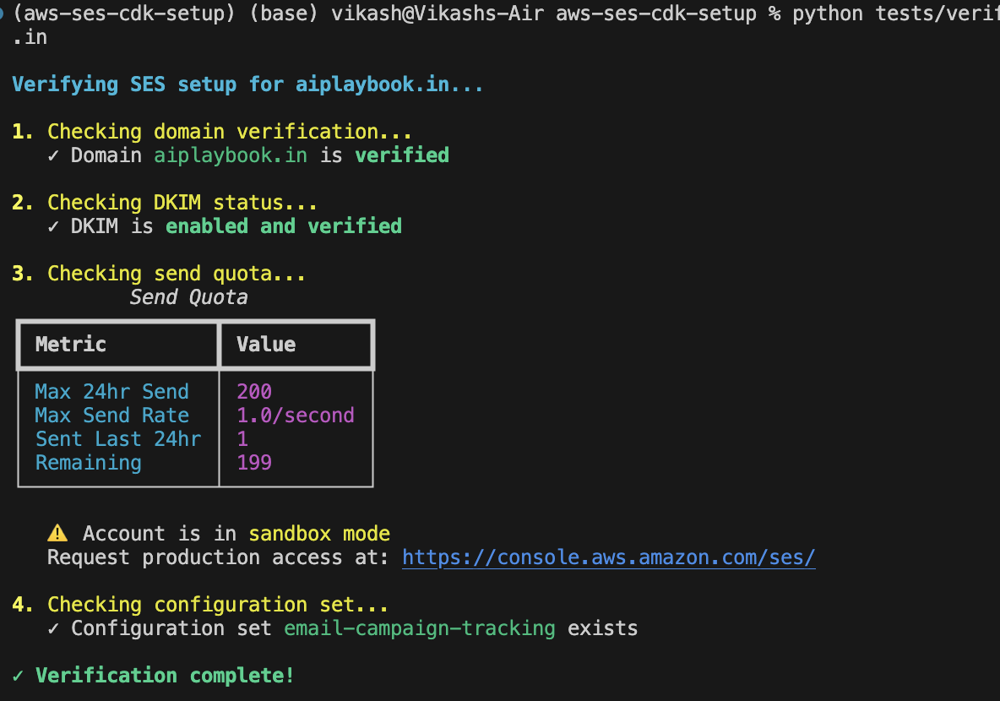
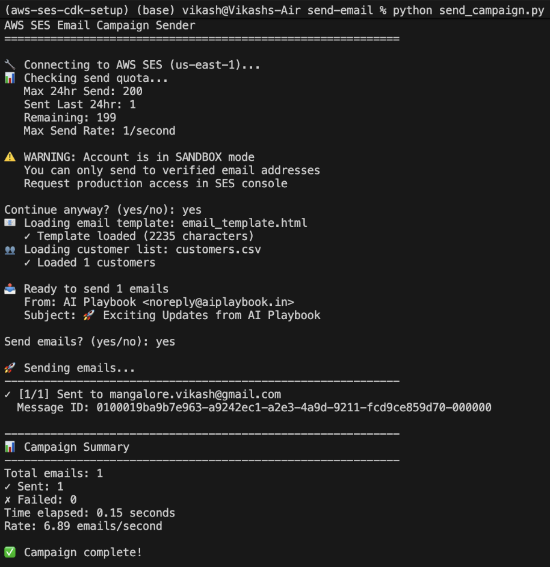
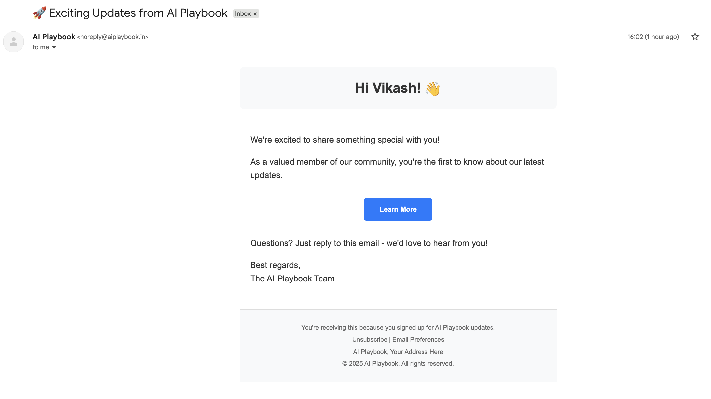

# AWS SES Setup
- Complete CDK setup for AWS SES with Route 53.
    - Email identity stack
    - Email notification stack
    - Email monitoring stack
- Verify the setup.
- Send a test email using html template.
- Clean up.

### Result of the setup
#### CDK Deployment successful

#### Email Sent successfully

#### Email received successfully



## Prerequisites

- AWS Account
- Domain registered and using Route 53 for DNS
- AWS CLI configured
- Python 3.11+
- Node.js 18+ (for CDK)

## Step 1 : Directory Structure

```
aws-ses-cdk-setup/
├── cdk/
│   ├── app.py
│   ├── stacks/
│   │   ├── __init__.py
│   │   ├── email_identity_stack.py
│   │   ├── email_notification_stack.py
│   │   └── email_monitoring_stack.py
│   ├── lambda/
│   │   ├── bounce_handler/
│   │   │   ├── handler.py
│   │   │   └── requirements.txt
│   │   └── complaint_handler/
│   │       ├── handler.py
│   │       └── requirements.txt
│   ├── cdk.json
│   ├── requirements.txt
│   └── README.md
└── .env
└── README.md
└── assets/
└── cleanup.sh
└── deployment.sh
└── pyproject.toml
└── quick_deploy.sh
└── send-email/
│   ├── customers.csv
│   ├── email_template.html
│   └── send_campaign.py
└── tests/
│   └── verify_setup.py
└── uv.lock
```


# Check DNS records were created
```
dig _dmarc.aiplaybook.in TXT +short

"v=DMARC1; p=quarantine; rua=mailto:dmarc-reports@aiplaybook.in; ruf=mailto:dmarc-forensics@aiplaybook.in; fo=1; pct=100; adkim=s; aspf=s"
```

# Check SES verification status
```
aws ses get-identity-verification-attributes \
  --identities aiplaybook.in
```
Should show: "VerificationStatus": "Success" (after DNS propagates)

# After Making Changes
```
# 1. Synthesize to check for errors
cdk synth

# 2. See what will change
cdk diff

# 3. Deploy
cdk deploy --all --require-approval never
```


### Verify setup

```python tests/verify_setup.py yourdomain.com```


### Verify the email is sent successfully

Be in the send-email directory and run the following command:

```python send_campaign.py```   

### To clean up

```cdk destroy --all``` 

OR use
```
# Make executable
chmod +x cleanup.sh

# Run it
./cleanup.sh
```